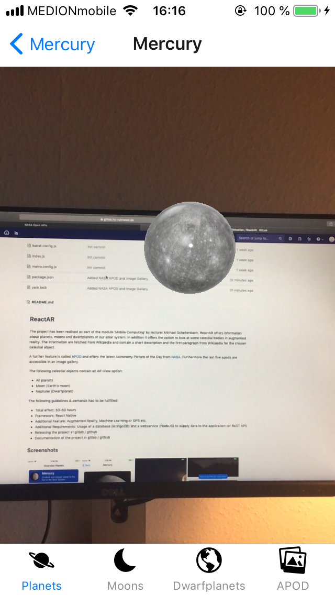
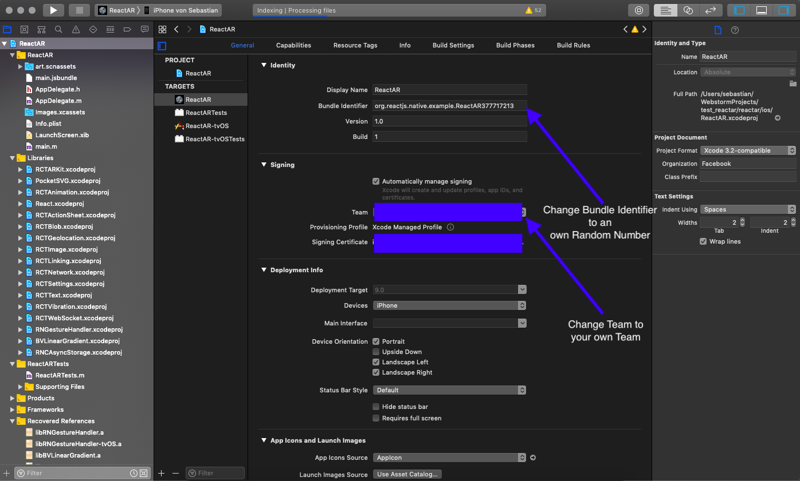

# ReactAR

The project has been realised as part of the module 'Mobile Computing' by lecturer Michael Schellenbach. ReactAR offers information about planets, moons and dwarfplanets of 
our solar system. In addition it offers the option to look at some celestial bodies in augmented reality. The information are fetched from Wikipedia and contain a short description
and the first paragraph from Wikipedia for the chosen celestial object.

A further feature is called [APOD](https://apod.nasa.gov/apod/astropix.html) and offers the latest Astronomy Picture of the Day from [NASA](https://www.nasa.gov). Furthermore the last five apods
are accessible in an image gallery.

The following celestial objects contain an AR-View option:
* All planets
* Moon (Earth's moon)
* Neptune (Dwarfplanet)

The following guidelines & demands had to be fullfilled:
*  Total effort: 50-60 hours
*  Framework: React Native
*  Additional Feature: Augmented Reality, Machine Learning or GPS etc.
*  Additional Requirements: Usage of a database (MongoDB) and a webservice (NodeJS) to supply data to the application (or ReST API)
*  Releasing the project at gitlab / github
*  Documentation of the project in gitlab / github

## Screenshots





## Getting Started

Make sure you have a package manager like [Yarn](https://yarnpkg.com/lang/en/) or [npm](https://www.npmjs.com) installed and at least [XCode](https://developer.apple.com/xcode/) 9 installed.
The following stepts are tested with Yarn on Mac OS Mojave 10.14.4 with XCode Version 10.2.1. Consider switching to Yarn if npm causes problems.

Open your terminal and navigate to a preferred folder where you want to store the ReactAR project (for example: ~/Documents)

Clone this repo:
```
git clone https://gitlab.hs-ruhrwest.de/ucseneum/reactar.git
```

Change to reactar dir:
```
cd reactar
```

Install neccessary packages with yarn:
```
yarn install
```

### Prerequisites

Apple's **iOS ARKit is only supported by Apple devices with A9 or later processors** on iOS 11. Make sure you have at least an iPhone SE or 6s to run the application on 
your hardware. Android devices are not supported due to not implemented AR-bindings.

To preview the Augmented Reality, it's neccessary to run/build the application on the device by using XCode 9 or later. It's **not possible to use the ARKit 
within the iOS Simulator**
. 

You need an own api key: [NASA Open APIs](https://api.nasa.gov/index.html). Take a look at **Installing** to learn more about how to use & implement the api key.

### Installing

Go to [NASA Open APIs](https://api.nasa.gov/index.html) and register yourself for an api key. 
Enter your api key in './env/api_key.js' on line 1. Save and Close 'api_key.js'.

### Usage iOS Simulator

If you want to use the iOS Simulator and pass on the augmented reality view, navigate to the 'reactar' project folder in your 
terminal and type: 

```
react-native run-ios
```
Building and starting the iOS Simulator might take some time.


### Usage Mobile Device

If you want to use the application on your device make sure your device is connected to your Mac.

* Open reactar in XCode (/reactar/ios/ReactAR.xcodeproj)
* Change Signature and Bundle Identifier: Replace every digit in the Bundle Identifier with an own, random number, for more details, take a look at the following screenshot
* Build & Run Application on your device
* Building might take some time
* You might need to trust the app on your device. Follow the instructions shown in XCode or on your device




## Built With

* [React Native](https://facebook.github.io/react-native/docs/getting-started) - The core framework used
* [React Native ARKit](https://github.com/react-native-ar/react-native-arkit) - React Native ARKit Binding for Apple's iOS ARKit
* [React Navigation](https://reactnavigation.org/docs/en/getting-started.html) - Navigation Component
* [React Redux](https://react-redux.js.org) - State Storage
* [MomentJS](http://momentjs.com) - Date Library
* [Wikipedia ReST API](https://en.wikipedia.org/api/rest_v1/) - Wikipedia ReST API Documentation
* [NASA Open APIs](https://api.nasa.gov/index.html) - NASA Open APIs
* [Apple Human Interface Guidelines](https://developer.apple.com/design/human-interface-guidelines/ios/overview/themes/) - Human Interface Guidelines


## Authors

* **Sebastian Neumann** - *Initial work*

## License

This project is licensed under the MIT License - see the [LICENSE.md](LICENSE.md) file for details